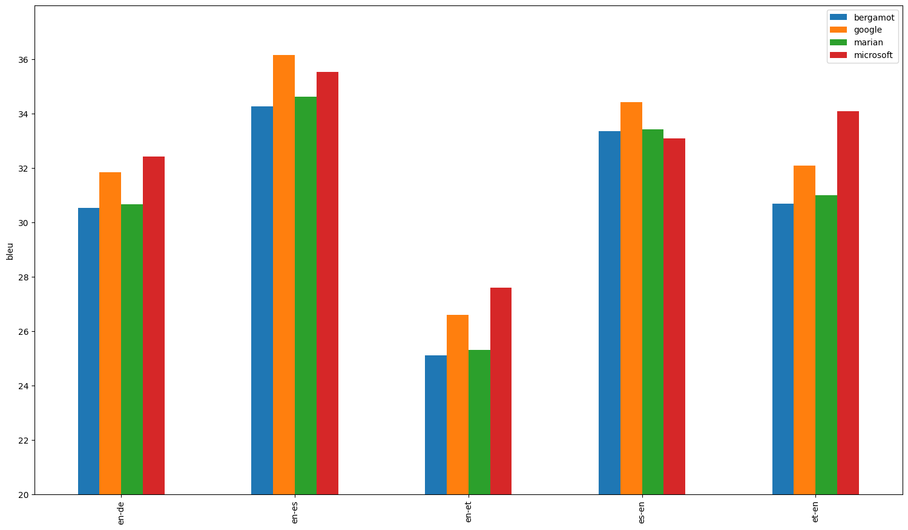
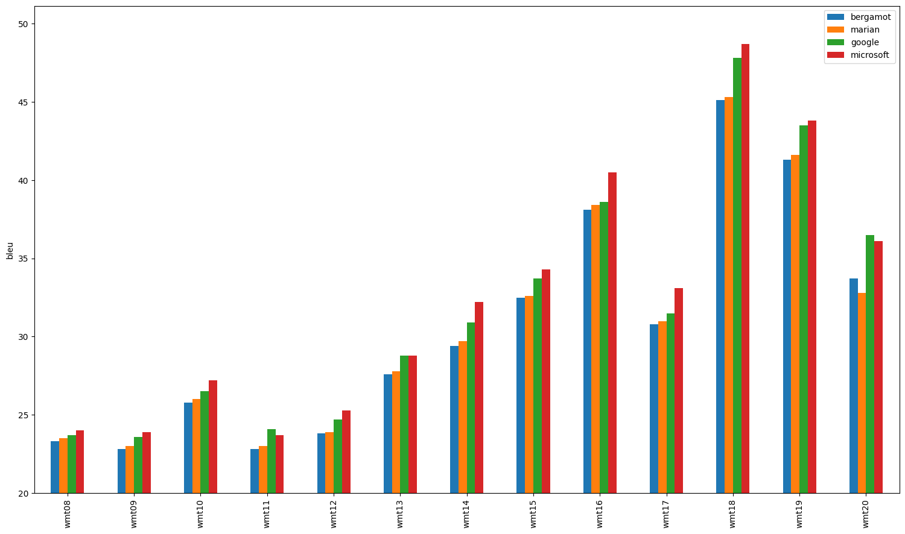
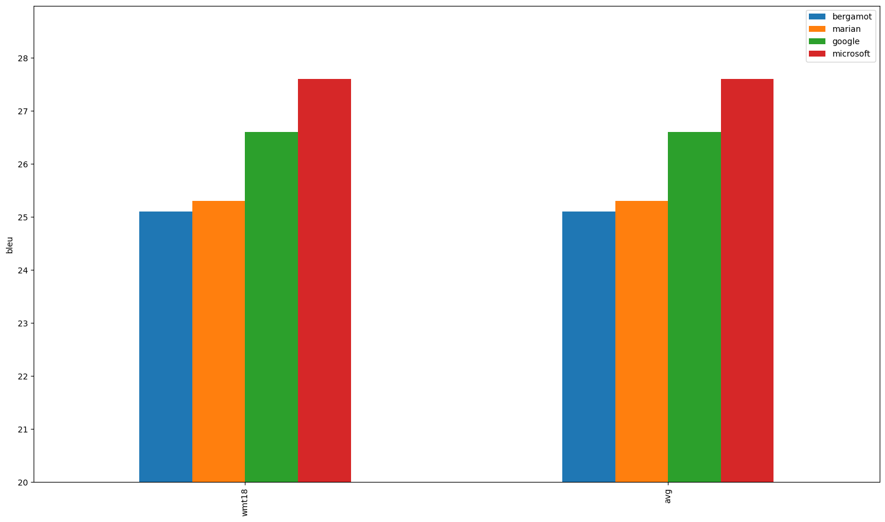
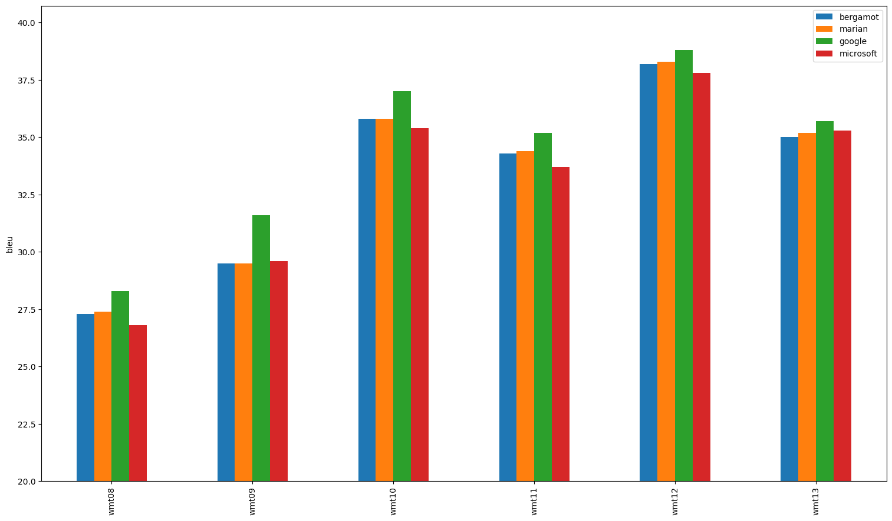
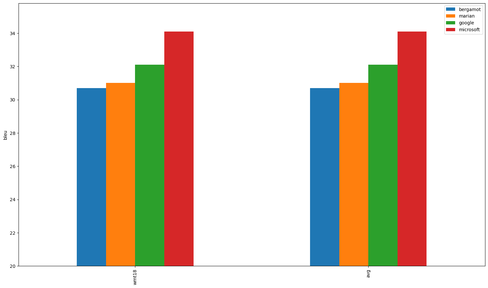

# Evaluation results

## Average on all datasets

## en-de

| Translator/Dataset | wmt08 | wmt09 | wmt10 | wmt11 | wmt12 | wmt13 | wmt14 | wmt15 | wmt16 | wmt17 | wmt18 | wmt19 | wmt20 | avg |
| --- | --- | --- | --- | --- | --- | --- | --- | --- | --- | --- | --- | --- | --- | --- |
| bergamot | 23.30 | 22.80 | 25.80 | 22.80 | 23.80 | 27.60 | 29.40 | 32.50 | 38.10 | 30.80 | 45.10 | 41.30 | 33.70 | 30.54 |
| google | 23.70 (+1.72%) | 23.60 (+3.51%) | 26.50 (+2.71%) | 24.10 (+5.70%) | 24.70 (+3.78%) | 28.80 (+4.35%) | 30.90 (+5.10%) | 33.70 (+3.69%) | 38.60 (+1.31%) | 31.50 (+2.27%) | 47.80 (+5.99%) | 43.50 (+5.33%) | 36.50 (+8.31%) | 31.84 (+4.26%) |
| marian | 23.50 (+0.86%) | 23.00 (+0.88%) | 26.00 (+0.78%) | 23.00 (+0.88%) | 23.90 (+0.42%) | 27.80 (+0.72%) | 29.70 (+1.02%) | 32.60 (+0.31%) | 38.40 (+0.79%) | 31.00 (+0.65%) | 45.30 (+0.44%) | 41.60 (+0.73%) | 32.80 (-2.67%) | 30.66 (+0.40%) |
| microsoft | 24.00 (+3.00%) | 23.90 (+4.82%) | 27.20 (+5.43%) | 23.70 (+3.95%) | 25.30 (+6.30%) | 28.80 (+4.35%) | 32.20 (+9.52%) | 34.30 (+5.54%) | 40.50 (+6.30%) | 33.10 (+7.47%) | 48.70 (+7.98%) | 43.80 (+6.05%) | 36.10 (+7.12%) | 32.43 (+6.20%) |

## en-es

| Translator/Dataset | wmt08 | wmt09 | wmt10 | wmt11 | wmt12 | wmt13 | avg |
| --- | --- | --- | --- | --- | --- | --- | --- |
| bergamot | 28.90 | 29.70 | 36.30 | 37.50 | 38.70 | 34.50 | 34.27 |
| google | 30.00 (+3.81%) | 30.90 (+4.04%) | 38.80 (+6.89%) | 39.90 (+6.40%) | 40.50 (+4.65%) | 36.90 (+6.96%) | 36.17 (+5.54%) |
| marian | 29.10 (+0.69%) | 30.00 (+1.01%) | 36.80 (+1.38%) | 37.80 (+0.80%) | 39.20 (+1.29%) | 34.90 (+1.16%) | 34.63 (+1.07%) |
| microsoft | 29.90 (+3.46%) | 30.70 (+3.37%) | 37.80 (+4.13%) | 39.10 (+4.27%) | 40.00 (+3.36%) | 35.70 (+3.48%) | 35.53 (+3.70%) |

## en-et

| Translator/Dataset | wmt18 | avg |
| --- | --- | --- |
| bergamot | 25.10 | 25.10 |
| google | 26.60 (+5.98%) | 26.60 (+5.98%) |
| marian | 25.30 (+0.80%) | 25.30 (+0.80%) |
| microsoft | 27.60 (+9.96%) | 27.60 (+9.96%) |

## es-en

| Translator/Dataset | wmt08 | wmt09 | wmt10 | wmt11 | wmt12 | wmt13 | avg |
| --- | --- | --- | --- | --- | --- | --- | --- |
| bergamot | 27.30 | 29.50 | 35.80 | 34.30 | 38.20 | 35.00 | 33.35 |
| google | 28.30 (+3.66%) | 31.60 (+7.12%) | 37.00 (+3.35%) | 35.20 (+2.62%) | 38.80 (+1.57%) | 35.70 (+2.00%) | 34.43 (+3.25%) |
| marian | 27.40 (+0.37%) | 29.50 (0.00%) | 35.80 (0.00%) | 34.40 (+0.29%) | 38.30 (+0.26%) | 35.20 (+0.57%) | 33.43 (+0.25%) |
| microsoft | 26.80 (-1.83%) | 29.60 (+0.34%) | 35.40 (-1.12%) | 33.70 (-1.75%) | 37.80 (-1.05%) | 35.30 (+0.86%) | 33.10 (-0.75%) |

## et-en

| Translator/Dataset | wmt18 | avg |
| --- | --- | --- |
| bergamot | 30.70 | 30.70 |
| google | 32.10 (+4.56%) | 32.10 (+4.56%) |
| marian | 31.00 (+0.98%) | 31.00 (+0.98%) |
| microsoft | 34.10 (+11.07%) | 34.10 (+11.07%) |

