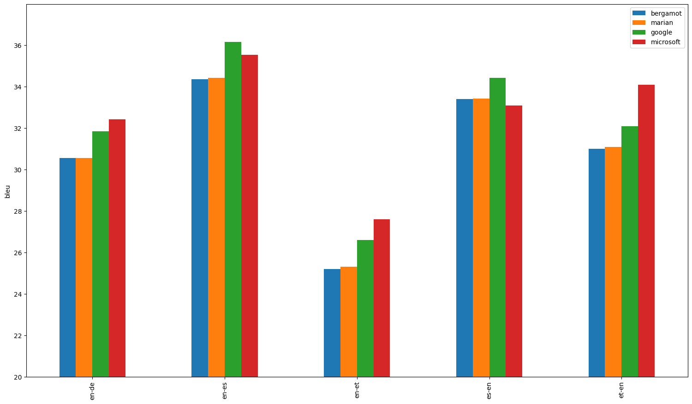

# Evaluation results

 Evaluation is done using [SacreBLEU](https://github.com/mjpost/sacrebleu) and official WMT ([Conference on Machine Translation](http://statmt.org/wmt17)) datasets.

## avg

| Translator/Dataset | en-de | en-es | en-et | es-en | et-en |
| --- | --- | --- | --- | --- | --- |
| bergamot | 30.56 | 34.37 | 25.20 | 33.40 | 31.00 |
| marian | 31 (0, 0%) | 34 (+0.05, +0.15%) | 25 (+0.1, +0.4%) | 33 (+0.03, +0.1%) | 31 (+0.1, +0.32%) |
| google | 32 (+1, +4.2%) | 36 (+2, +5.2%) | 27 (+1, +5.6%) | 34 (+1, +3.1%) | 32 (+1, +3.5%) |
| microsoft | 32 (+2, +6.1%) | 36 (+1, +3.4%) | 28 (+2, +9.5%) | 33 (-0.3, -0.9%) | 34 (+3, +10%) |

## en-de

| Translator/Dataset | wmt08 | wmt09 | wmt10 | wmt11 | wmt12 | wmt13 | wmt14 | wmt15 | wmt16 | wmt17 | wmt18 | wmt19 | wmt20 |
| --- | --- | --- | --- | --- | --- | --- | --- | --- | --- | --- | --- | --- | --- |
| bergamot | 23.30 | 22.70 | 25.80 | 22.90 | 23.90 | 27.60 | 29.30 | 32.30 | 38.40 | 30.70 | 45.10 | 41.40 | 33.90 |
| marian | 24 (+0.2, +0.86%) | 23 (+0.2, +0.88%) | 26 (+0.1, +0.39%) | 23 (+0.1, +0.44%) | 24 (0, 0%) | 28 (+0.1, +0.36%) | 30 (+0.2, +0.68%) | 32 (0, 0%) | 38 (+0.1, +0.26%) | 31 (+0.1, +0.33%) | 45 (0, 0%) | 42 (+0.2, +0.48%) | 33 (-1, -3.8%) |
| google | 24 (+0.4, +1.7%) | 24 (+0.9, +4%) | 26 (+0.7, +2.7%) | 24 (+1, +5.2%) | 25 (+0.8, +3.3%) | 29 (+1, +4.3%) | 31 (+2, +5.5%) | 34 (+1, +4.3%) | 39 (+0.2, +0.52%) | 32 (+0.8, +2.6%) | 48 (+3, +6%) | 44 (+2, +5.1%) | 36 (+3, +7.7%) |
| microsoft | 24 (+0.7, +3%) | 24 (+1, +5.3%) | 27 (+1, +5.4%) | 24 (+0.8, +3.5%) | 25 (+1, +5.9%) | 29 (+1, +4.3%) | 32 (+3, +9.9%) | 34 (+2, +6.2%) | 40 (+2, +5.5%) | 33 (+2, +7.8%) | 49 (+4, +8%) | 44 (+2, +5.8%) | 36 (+2, +6.5%) |

## en-es

| Translator/Dataset | wmt08 | wmt09 | wmt10 | wmt11 | wmt12 | wmt13 |
| --- | --- | --- | --- | --- | --- | --- |
| bergamot | 28.90 | 29.70 | 36.60 | 37.70 | 38.60 | 34.70 |
| marian | 29 (0, 0%) | 30 (+0.1, +0.34%) | 37 (+0.1, +0.27%) | 38 (0, 0%) | 39 (+0.1, +0.26%) | 35 (0, 0%) |
| google | 30 (+1, +3.8%) | 31 (+1, +4%) | 39 (+2, +6%) | 40 (+2, +5.8%) | 40 (+2, +4.9%) | 37 (+2, +6.3%) |
| microsoft | 30 (+1, +3.5%) | 31 (+1, +3.4%) | 38 (+1, +3.3%) | 39 (+1, +3.7%) | 40 (+1, +3.6%) | 36 (+1, +2.9%) |

## en-et

| Translator/Dataset | wmt18 |
| --- | --- |
| bergamot | 25.20 |
| marian | 25 (+0.1, +0.4%) |
| google | 27 (+1, +5.6%) |
| microsoft | 28 (+2, +9.5%) |

## es-en

| Translator/Dataset | wmt08 | wmt09 | wmt10 | wmt11 | wmt12 | wmt13 |
| --- | --- | --- | --- | --- | --- | --- |
| bergamot | 27.20 | 29.50 | 35.90 | 34.30 | 38.20 | 35.30 |
| marian | 27 (0, 0%) | 30 (0, 0%) | 36 (0, 0%) | 34 (+0.1, +0.29%) | 38 (0, 0%) | 35 (+0.1, +0.28%) |
| google | 28 (+1, +4%) | 32 (+2, +7.1%) | 37 (+1, +3.1%) | 35 (+0.9, +2.6%) | 39 (+0.6, +1.6%) | 36 (+0.4, +1.1%) |
| microsoft | 27 (-0.4, -1.5%) | 30 (+0.1, +0.34%) | 35 (-0.5, -1.4%) | 34 (-0.6, -1.7%) | 38 (-0.4, -1%) | 35 (0, 0%) |

## et-en

| Translator/Dataset | wmt18 |
| --- | --- |
| bergamot | 31.00 |
| marian | 31 (+0.1, +0.32%) |
| google | 32 (+1, +3.5%) |
| microsoft | 34 (+3, +10%) |

